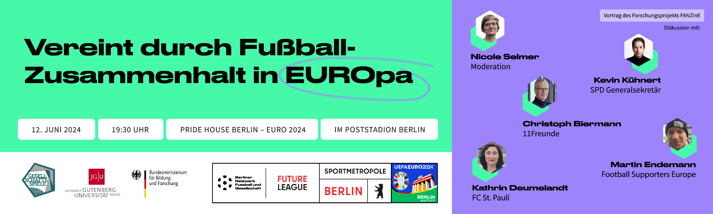

**Football, European identities and social cohesion in Europe**

The **FANZinE project** explores the potential of professional men's club football for shaping and fostering shared identity and social cohesion in Europe. Football as one of the most popular and unifying cultural phenomena on the continent transcends geographical, cultural, and linguistic boundaries. Its universal appeal makes it a potent tool for fostering connections and common ground among diverse European citizens. As a highly Europeanized sport with regular matches between teams from all over Europe, freedom of movement for players and personnel, intense media coverage, and dense cross-border networks of fans, football not only creates shared experiences, but also reflects the interconnectedness of Europe itself. Fans experience Europe, form connections to other Europeans, and explore a Europeanised life-world through their lived fandom. By analysing football and football fandom in Europe, this project seeks to highlight the intricate ways in which following football and and participating in football-related activities can contribute to the formation of European identities and the strengthening of social bonds. It aims to provide valuable insights into how a seemingly simple sport can play a pivotal role in fostering a more united and cohesive Europe “from below”.

FANZinE builds on and expands the work done by the [EUFOOT-project ('The identity effect of Europeanised lifeworlds. Becoming European through Football?')](https://eufoot.github.io/){:target="_blank" rel="noopener"}.

# Upcoming Events

"Vereint durch Fußball - Zusammenhalt in EUROpa" on June 12, 2024, in Berlin will discuss how football can strengthen social cohesion in Europe amidst significant political and social challenges, featuring a keynote, research presentations, and a panel discussion with experts.

- 13th June: Presentation and Discussion ["Fußball verbindet?! Fankultur zur Stärkung des sozialen Zusammenhaltes in Europa"](https://www.hannover.de/Kultur-Freizeit/Architektur-Geschichte/Erinnerungskultur/Gedenkst%C3%A4tte-Ahlem/Programm-Gedenkst%C3%A4tte-Ahlem/%E2%80%9EFu%C3%9Fball-verbindet%E2%80%9C) in the clubhouse of SV Arminia Hannover 
- 25th/26th June: Presentation "Fan-ning the European flame: Building identity and social cohesion through football fandom" at the [2024 Sport&EU Conference](https://www.sportandeu.com/2024-conference), in Angers (France)
